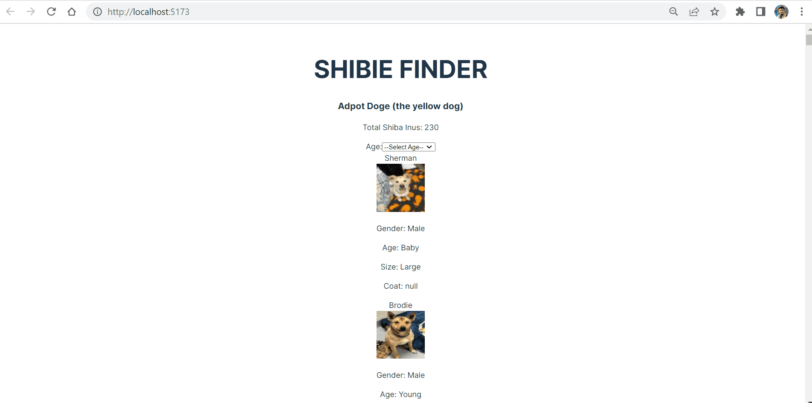

# DoggoSearch

Submitted by: Johnny A. Cortez

Search for Shibies(Shiba Inus)!

Time spent: 6 hours spent in total

## Required Features

The following **required** functionality is completed:

List of Data - completed
  
3 Summary Data Statistics - partially

Search Data - not completed

Filter Data - partially

The following **optional** features are implemented:
...

## Video Walkthrough

Here's a walkthrough of implemented features:

GIF created with ScreenToGif

## Notes

## License

    Copyright [2023] [Johnny A. Cortez]

    Licensed under the Apache License, Version 2.0 (the "License");
    you may not use this file except in compliance with the License.
    You may obtain a copy of the License at

        http://www.apache.org/licenses/LICENSE-2.0

    Unless required by applicable law or agreed to in writing, software
    distributed under the License is distributed on an "AS IS" BASIS,
    WITHOUT WARRANTIES OR CONDITIONS OF ANY KIND, either express or implied.
    See the License for the specific language governing permissions and
    limitations under the License.
